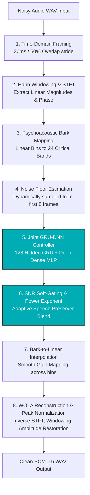

# Hybrid Speech Enhancement Pipeline Flowchart

This document contains the final, upgraded architectural flowchart of the **Speech Enhancement Engine** (using Joint GRU-DNN and psychoacoustic DSP).

You can copy the **Mermaid code block** directly into your markdown presentation, or use it as a reference for drawing slides.

---

## 📊 Pipeline Flowchart (Mermaid)

---

## 📝 Detailed Stage-by-Step Breakdown

1. **Time-Domain Framing:** Audio is cut into 30ms frames overlapping by 50% (stride of 15ms) to guarantee fine temporal resolution.
2. **Hann Windowing & STFT:** Frames are windowed using a **Hann Window** (satisfying the Constant Overlap-Add constraint) and converted to $241$ linear frequency bins using the Fast Fourier Transform (FFT). The noisy phase spectrum is saved for reconstruction.
3. **Psychoacoustic Bark Mapping:** The 241 linear bins are mapped to **24 Bark scale critical bands** via a single matrix dot product ($M_{L \to B}$ matrix). This reduces neural net features by **90%**.
4. **Noise Floor Estimation:** The baseline noise floor is dynamically estimated from the first 8 frames (initial silent segment) to calculate local frame SNR.
5. **Joint GRU-DNN Controller:** The 128-unit stateful GRU tracks slowly-moving environmental noise statistics, and the Deep Dense neural network (88.5k parameters) estimates the optimal gain mask.
6. **SNR Soft-Gating & Power Exponent:** An adaptive Gaussian soft gate evaluates local SNR per band. If the voice is strong, the gate bypasses neural network attenuation to prevent muffledness. The mask is squared ($\text{gain}^{2.0}$) to aggressively silence residual background noise.
7. **Linear Interpolation:** The 24 Bark gains are smoothly interpolated back to 241 linear frequency bins to prevent edge discontinuities (robotic gurgling).
8. **WOLA Synthesis & Normalization:** The magnitude spectrum is merged with the original phase, reconstructed using Inverse FFT, and normalized back to the original speech peak volume.
