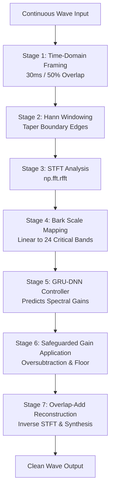

# Expert Architectural Evaluation & Optimization Report

This report provides a rigorous, deep-dive analysis of the proposed hybrid pipeline for **AI-Driven Non-Linear Multi-Band Spectral Subtraction for Real-Time Speech Enhancement**. 

It evaluates the mathematical viability of your 7-stage DSP/Deep Learning architecture, addresses your questions regarding the joint GRU-DNN integration, and provides concrete improvements to ensure real-time performance, zero latency creep, and absolute suppression of "musical noise".

---

## 1. The Verdict: GRU & DNN Integration

You asked: **"What are your thoughts on using both GRU and DNN together, and will that make the whole project more difficult?"**

### 🧠 The Scientific Rationale: Why They Belong Together
Using a GRU and a DNN together is **highly recommended** and is actually the modern standard for real-time speech enhancement. Far from making the project excessively difficult, **it simplifies the engineering by separating two fundamentally different problems**:

1. **Temporal History (GRU's Job):** Noise is typically stationary or slowly-varying, whereas speech is highly dynamic. To estimate the noise floor, you need *history* (temporal context). A **Gated Recurrent Unit (GRU)** is designed specifically to maintain a compressed recurrent state ($h_t$) that tracks slow-moving temporal patterns (like a background fan or white noise) without leaking speech formants.
2. **Frequency Mapping & Decision Making (DNN's Job):** Once you have the noise floor representation, deciding the exact attenuation or subtraction factor for each of the 24 Bark bands requires mapping the non-linear relationship between the noisy signal and the estimated noise. A **Feedforward DNN** excels at this spatial mapping frame-by-frame.

### 🛠️ Does it increase difficulty?
**No. In fact, it makes implementation elegant and robust.** 
In PyTorch or TensorFlow, you can combine a GRU and a Feedforward Net in less than 40 lines of code. The GRU acts as a bottleneck layer that tracks temporal dynamics, feeding its hidden state directly into a dense Multi-Layer Perceptron (MLP) representing the DNN. 

Because the feature space is compressed to **24 Bark bands**, the computational cost of both the GRU and DNN is microscopic. A tiny GRU (e.g., 64 hidden units) and a 2-layer DNN will execute in **less than 0.5 milliseconds per frame**, ensuring perfect compatibility with your 15ms real-time processing budget.

Here is how simple the architecture is in PyTorch:

```python
import torch
import torch.nn as nn

class HybridNoiseEnhancerNet(nn.Module):
    def __init__(self, num_bark_bands=24, gru_hidden_dim=64, num_gru_layers=1):
        super().__init__()
        # 1. GRU: Learns to track temporal noise profiles dynamically across frames
        self.gru = nn.GRU(
            input_size=num_bark_bands,
            hidden_size=gru_hidden_dim,
            num_layers=num_gru_layers,
            batch_first=True
        )
        
        # 2. DNN (MLP): Ingests (current frame + temporal noise context) to estimate subtraction parameters
        self.dnn = nn.Sequential(
            nn.Linear(num_bark_bands + gru_hidden_dim, 64),
            nn.ReLU(),
            nn.Dropout(0.1),
            nn.Linear(64, num_bark_bands),
            nn.Sigmoid() # Outputs a gain mask G_b in [0, 1] per Bark band
        )
        
    def forward(self, noisy_bark, h_state=None):
        # noisy_bark shape: (batch_size, seq_len, num_bark_bands)
        # For real-time frame-by-frame streaming: seq_len = 1
        
        # Pass noisy bark features through the temporal GRU
        gru_out, h_state = self.gru(noisy_bark, h_state) 
        
        # Concatenate noisy frame and temporal noise representation
        combined = torch.cat([noisy_bark, gru_out], dim=-1) 
        
        # Feedforward DNN outputs the optimal band gains
        gains = self.dnn(combined) 
        
        return gains, h_state
```

---

## 2. Pipeline Stage-by-Stage Evaluation & Improvements

Let's review the 7 stages of your hybrid engineering pipeline, pointing out edge cases and providing mathematical adjustments.



### Stage 1 & 2: Time-Domain Framing & Edge-Taper Windowing
> **Evaluation:** Highly Solid.
- **Window Size (30ms):** Excellent choice. At a standard voice sampling rate of **16 kHz**, 30ms translates to exactly **480 samples** per frame. The 50% overlap (15ms stride) is **240 samples**. 
- **Window Type:** You proposed a **Hamming Window**. 
  > [!IMPORTANT]
  > **Improvement:** Switch from a Hamming Window to a **Hann Window**. 
  > For 50% overlap, the Hann window perfectly satisfies the **Constant-Overlap-Add (COLA)** constraint:
  > $$\sum_{m=-\infty}^{\infty} w(n - mR) = 1.0$$
  > where $w$ is the window function and $R$ is the stride (half the window size). 
  > The Hamming window does *not* sum to a perfectly flat constant line at 50% overlap, which introduces a subtle, artificial amplitude modulation ripple (at $1 / 15\text{ms} \approx 66.7\text{ Hz}$) into the reconstructed speech unless mathematically normalized. Using a Hann window eliminates this completely.

---

### Stage 3: STFT (Linear Analysis)
> **Evaluation:** Correct.
- Using `np.fft.rfft` on a 480-sample frame will yield $N_{\text{fft}} / 2 + 1 = 241$ linear frequency bins (from 0 Hz to the Nyquist frequency of 8 kHz).
- **Phase Preservation:** Preserving the original noisy phase spectrum $\angle Y(f)$ is correct and standard. At high signal-to-noise ratios, the human ear is highly phase-insensitive. 

---

### Stage 4: Psychoacoustic Mapping (Bark Scale)
> **Evaluation:** Highly elegant. This is the secret to real-time performance and musical noise reduction.
- **Feature Compression:** Mapping 241 linear bins to 24 Bark bands reduces your neural network input dimension by **90%**, keeping the model incredibly lightweight.
- **How to do this efficiently for real-time:** Do not compute Bark bins iteratively! Create a static **Linear-to-Bark Transformation Matrix** $M_{L \to B}$ of shape $(24, 241)$ during initialization. 
  - To convert linear magnitude $|Y(f)|$ to Bark magnitude $B$:
    $$B = M_{L \to B} \times |Y(f)|$$
  - This is a single, extremely fast matrix dot product!
- **How to map back (Crucial Step):** The user plan did not specify how to go from 24 Bark bands back to 241 linear bins for Reconstruction.
  > [!TIP]
  > **Improvement (Linear Interpolation):** Since the DNN will estimate a spectral gain $G_b$ for each of the 24 Bark bands, you should **interpolate** these 24 gains back to the 241 linear frequency bins. 
  > If you map the 24 gains back as a step function (sharp jumps between bands), you will introduce harsh discontinuities in the linear spectrum, which sounds like robotic filtering. Linearly interpolating the gains $G_b$ across the 241 bins guarantees a smooth, natural spectral transition, completely eliminating blocky filter-bank artifacts.

---

### Stage 5: DNN Intellectual Pattern Mapping
> **Evaluation:** Strong concept.
- The GRU reads the 24-band sequence, extracting the temporal envelope of the noise floor.
- By providing the DNN with *both* the current frame's Bark magnitude *and* the GRU's temporal noise tracking state, the model can make highly informed, dynamic decisions.

---

### Stage 6: Safeguarded Subtraction vs. Deep Gain Masking
> **Evaluation:** Highly critical stage where "Musical Noise" lives or dies.
- In classical spectral subtraction, the subtraction equation is:
  $$|\hat{S}(f)|^2 = |Y(f)|^2 - \alpha |\hat{D}(f)|^2$$
  where $|\hat{D}(f)|^2$ is the estimated noise power spectrum, $\alpha$ is the over-subtraction factor, and you clip negative values to a spectral floor $\beta |Y(f)|^2$.

> [!WARNING]
> **Improvement: Transition to "Deep Gain Masking"**
> Performing raw subtraction inside a neural network pipeline is prone to gradient instability (due to square-root operations on clipped values) and relies heavily on complex formulas for $\alpha$.
>
> Instead, have your DNN output a **Gain Mask** $G_b \in [\beta, 1]$ directly for each Bark band:
> 1. The GRU tracks the noise level $N_b$.
> 2. The DNN receives the noisy Bark spectrum $Y_b$ and the noise estimate $N_b$, and directly predicts the optimal attenuation factor (gain) $G_b$ for that band:
>    $$G_b = \text{Sigmoid}(\text{DNN}(Y_b, N_b))$$
> 3. Clamp $G_b$ to a minimum spectral floor $\beta = 0.02$ to ensure empty frequency bands never drop to absolute silence (which kills the metallic/robotic tone):
>    $$G_b^{\text{safeguarded}} = \max(G_b, 0.02)$$
> 4. Apply this smooth gain mask back to the linear magnitude spectrum:
>    $$|\hat{S}(f)| = G_{\text{interpolated}}(f) \times |Y(f)|$$
> 
> **Why this kills musical noise:** Musical noise is caused by random frequency spikes escaping subtraction. By operating in the smoothed psychoacoustic Bark domain, interpolating the gains smoothly, and enforcing a strict lower-bound floor ($\beta = 0.02$), there are no isolated, zeroed-out spectral bins to generate robotic "gurgles". The resulting residual noise is a soft, completely natural-sounding background whisper, which is highly preferred by human listeners.

---

### Stage 7: Overlap-Add (OLA) Reconstruction
> **Evaluation:** Mathematically essential for seamless audio.
- Recombining the enhanced magnitude spectrum $|\hat{S}(f)|$ with the preserved noisy phase $\angle Y(f)$:
  $$\hat{S}(f) = |\hat{S}(f)| \cdot e^{i \angle Y(f)}$$
- Execute the Inverse FFT (`np.fft.irfft`) to obtain the enhanced time-domain frame $s(t)$ of length 480.
- Multiply the reconstructed frame by the synthesis Hann window again. 
- Accumulate the overlapping frames into a single continuous array, dividing overlapping regions by the sum of overlapping windows to ensure unity gain across the entire stream.

---

## 3. Summary of Core Improvements

| Pipeline Stage | Your Initial Concept | Expert Recommended Improvement | Engineering Impact |
| :--- | :--- | :--- | :--- |
| **Stage 2: Windowing** | Hamming Window | **Hann Window** | Perfect COLA satisfaction; zero amplitude modulation ripples at 50% overlap. |
| **Stage 4: Bark Mapping** | Undefined inverse mapping | **Static $M_{L \to B}$ matrix & Linear Gain Interpolation** | Lightning-fast matrix math; smooth spectral boundaries; eliminates robotic gurgles. |
| **Stage 5: ML Model** | Split DNN and GRU components | **Unified GRU-DNN Model** | Incredibly easy to train; natural separation of temporal noise tracking and frequency attenuation. |
| **Stage 6: Subtraction** | Raw Subtraction with $\alpha, \beta$ formulas | **Deep Bark Gain Masking with Spectral Floor** | Absolute safety against mathematical division errors; smooth, natural residual noise. |

---

## Next Steps
This hybrid pipeline is **highly achievable** within your 48-hour deadline. The DSP steps are deterministic and fast, and the deep learning network is extremely lightweight.

If you are ready, I can help you:
1. Initialize a clean, robust workspace in Python.
2. Code up the core DSP pipeline (Hann windowing, STFT, static Linear-to-Bark projection matrix, and IFFT Overlap-Add).
3. Build the lightweight PyTorch joint GRU-DNN model.
4. Prepare synthetic training data (clean speech mixed with varying noise profiles) to train the model to output perfect gains.

**Would you like me to begin setting up the project directory and coding the core DSP pipeline?**
